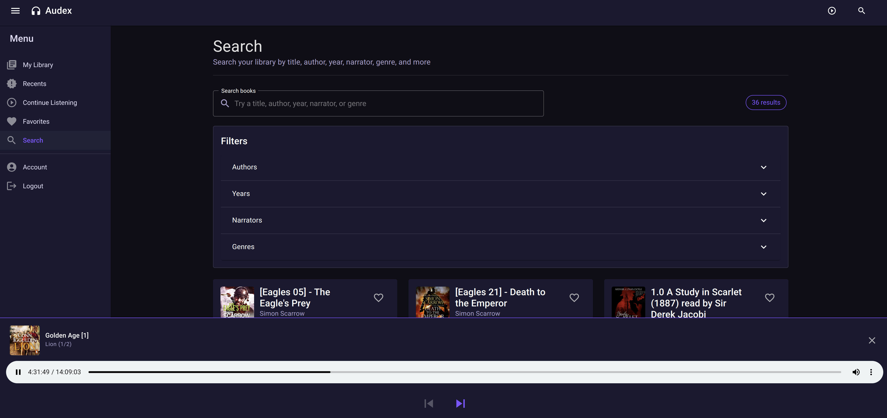
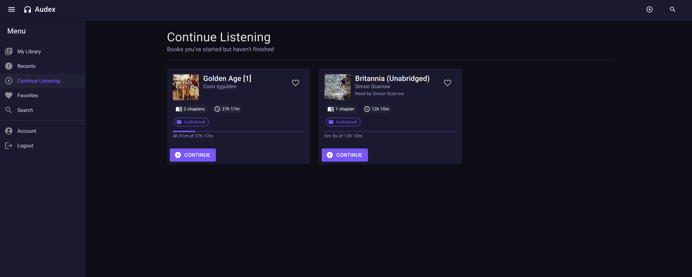
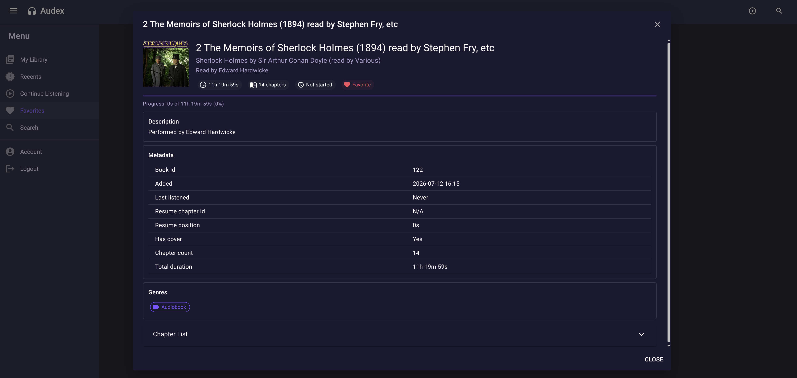

# Audex
Combining "Audio" with "Codex", the historical term for an ancient manuscript or book

Or in laymans terms, this is a audio book server + player where the player is also PWA enabled.



## Getting Started

### Prerequisites

- [Docker](https://docs.docker.com/get-docker/) and Docker Compose

### Running with Docker Compose

1. Clone the repository:
   ```bash
   git clone https://github.com/SneWs/Audex.git
   cd Audex
   ```

2. (Optional) Create a `.env` file to point to your audiobook library:
   ```bash
   AUDIOBOOKS_PATH=/path/to/your/audiobooks
   ```
   If not set, the `audio-source/` directory in the repo root is used.

3. Start the stack:
   ```bash
   docker compose up -d
   ```

4. Open `http://localhost:5010` in your browser, register an account, and your library will be scanned automatically on first run.

### Configuration

| Variable | Default | Description |
|----------|---------|-------------|
| `AUDIOBOOKS_PATH` | `./audio-source` | Host path containing your audiobook folders |
| `Jwt__Secret` | (set in compose) | JWT signing key — change in production |

### Architecture

- **Client** (port 5010) — Blazor WebAssembly PWA served via nginx. Proxies `/api/` and `/hubs/` to the API.
- **API** (port 5011) — ASP.NET Core minimal API. Streams audio, manages metadata, real-time notifications via SignalR.
- **Database** — PostgreSQL 16, internal to the Docker network (not exposed to host).

The API automatically enriches book metadata from Google Books and Open Library during scans.

---

## Development

### Requirements

- [.NET 10 SDK](https://dotnet.microsoft.com/download/dotnet/10.0)
- [Docker](https://docs.docker.com/get-docker/) (for PostgreSQL)

### Setup

1. Start the database:
   ```bash
   docker compose up db -d
   ```

2. Apply EF Core migrations:
   ```bash
   dotnet ef database update --project Server/Server.csproj
   ```

3. Run the API server:
   ```bash
   dotnet run --project Server/Server.csproj
   ```
   The API will be available at `http://localhost:5000`.

4. Run the Blazor client (in a separate terminal):
   ```bash
   dotnet run --project Client/Client.csproj
   ```

### Building

```bash
dotnet build
```

### Adding a Migration

```bash
dotnet ef migrations add <MigrationName> --project Server/Server.csproj
```

### Useful Commands

| Command | Description |
|---------|-------------|
| `docker compose up -d` | Start all services |
| `docker compose up -d --build` | Rebuild and start |
| `docker compose logs -f api` | Tail API logs |
| `docker compose down` | Stop all services |
| `docker compose down -v` | Stop and delete database volume |

---

## Screenshots




 

